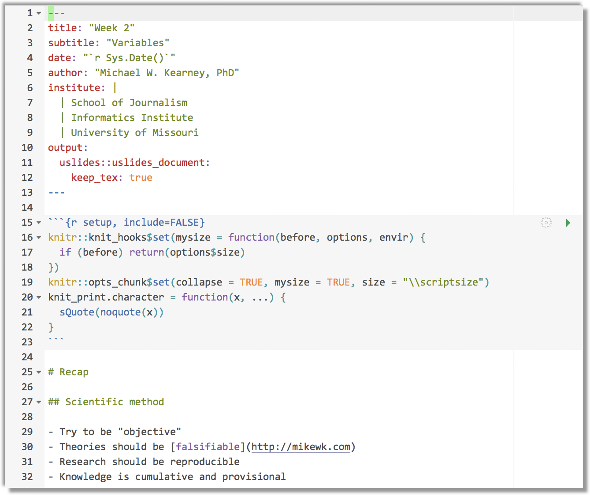
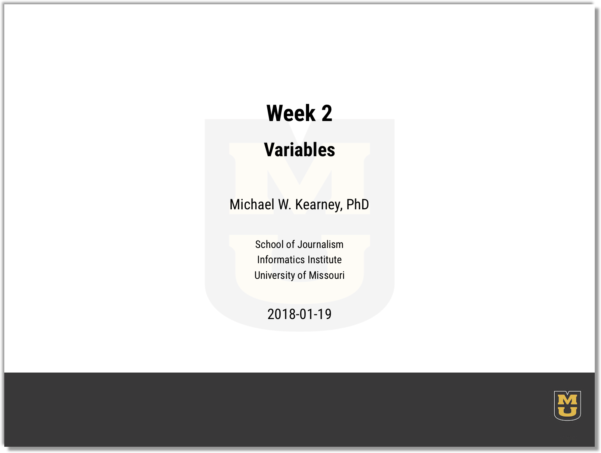
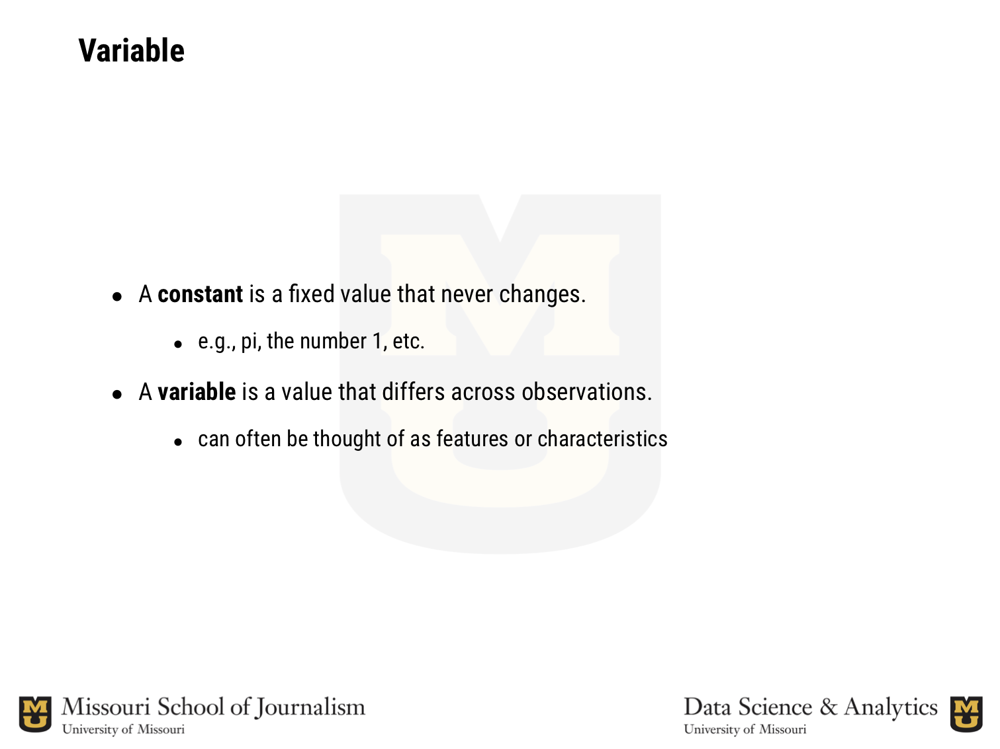
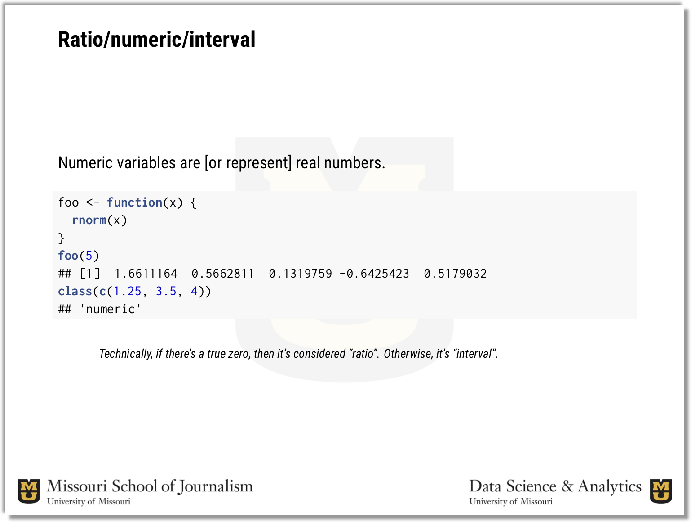

uslides
-------

Rmarkdown template for pretty university-themed beamer (pdf) presentations.

Requirements
------------

-   The fonts [Roboto Condensed](https://fonts.google.com/specimen/Roboto+Condensed) and [Inconsolata](https://fonts.google.com/specimen/Inconsolata) must be downloaded from [fonts.google.com](https://fonts.google.com/).
-   is used to compile the document; specifically, the `tex_engine` is `xelatex`

Example
-------

See an [example Rmd file](tools/readme/example.Rmd) and its [pdf output](tools/readme/example.pdf). Screen shots of the example are inserted below.

### Some of the rmarkdown code.

### The title slide.

### A slide with bullet points.

### A slide with R code and output.

