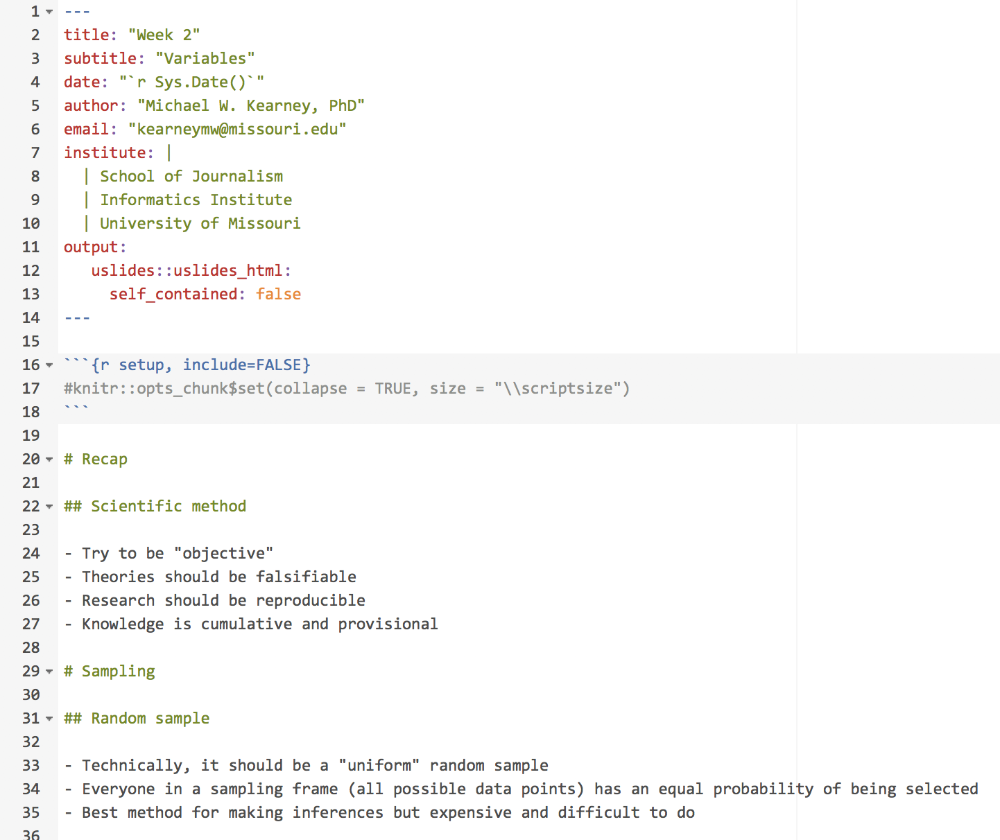
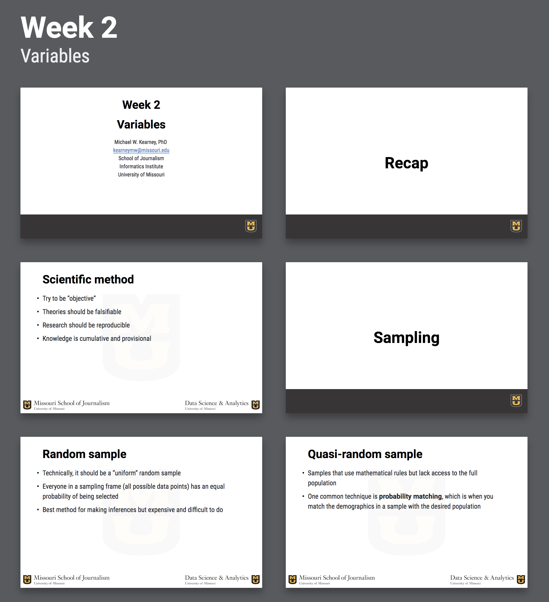
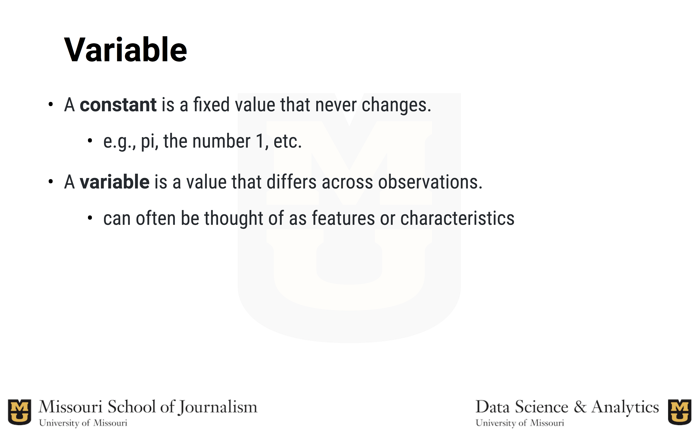

uslides
-------

Rmarkdown template for pretty university-themed beamer (pdf) presentations.

Installation
------------

``` r
## install devtools if it's not already installed
if (!requireNamespace("devtools", quietly = TRUE)) install.packages("devtools")

## install uslides from github
devtools::install_github("mkearney/uslides")
```

Requirements
------------

-   The fonts [Roboto Condensed](https://fonts.google.com/specimen/Roboto+Condensed), [Roboto Bold](https://fonts.google.com/specimen/Roboto), and [Inconsolata](https://fonts.google.com/specimen/Inconsolata) must be downloaded from [fonts.google.com](https://fonts.google.com/).
-   [\\LaTeX](https://www.latex-project.org/get/) (and the `tex_engine` is `xelatex` if that matters)

Example
-------

See example [HTML](https://mkearney.github.io/uslides) and [PDF](https://mkearney.github.io/uslides/index.pdf) presentations. Screen shots of the example are included below.

### uslides .Rmd template

<p align="center">

</p>
 

### Easily navigate slides

<p align="center">

</p>
<!-- <p align="center"></p> -->
 

### Title slide

<p align="center">

</p>
 

### Display R code and output

<p align="center">

</p>
